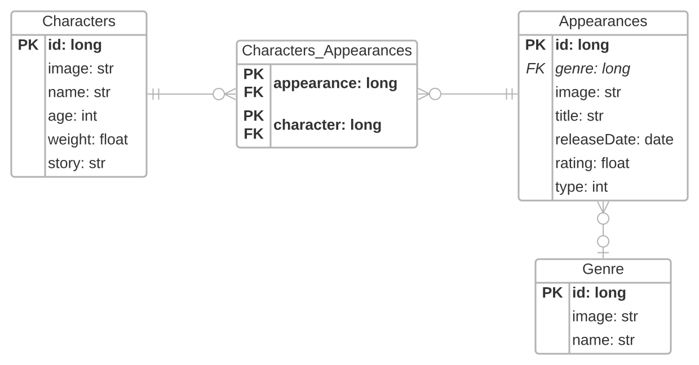
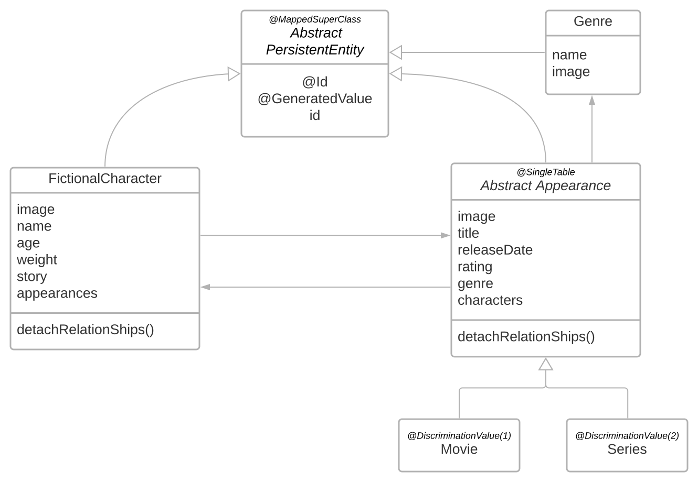
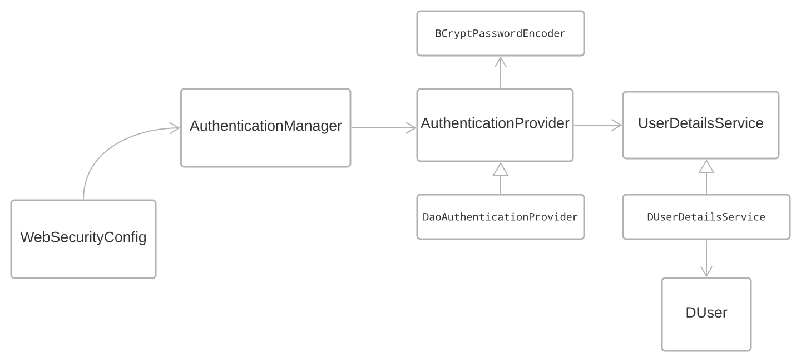
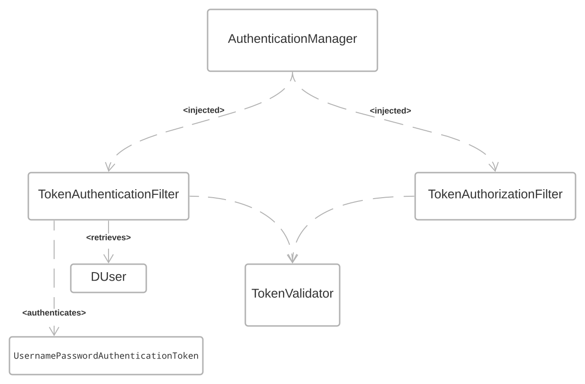
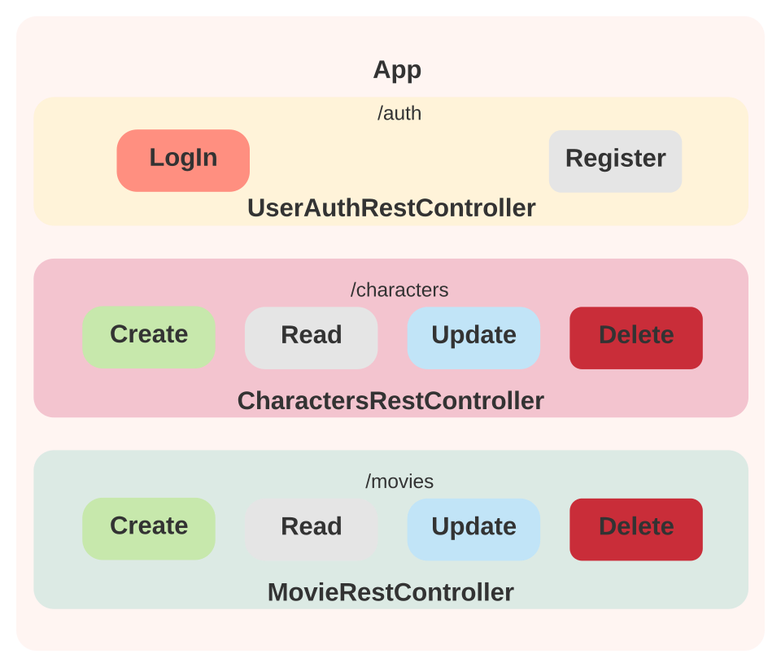

# CHALLENGE BACKEND - Java Spring Boot (API) :rocket:

This was a challenge by [Alkemy](https://www.alkemy.org/) solved by [Tomás Sánchez](https://github.com/tomasanchez)

You can read the challenge requiremnts in [this file](./docs/challenge.pdf)  (spanish).

## Content
- [CHALLENGE BACKEND - Java Spring Boot (API) :rocket:](#challenge-backend---java-spring-boot-api-rocket)
  - [Content](#content)
  - [Documentation](#documentation)
    - [Database Model](#database-model)
    - [Application Design](#application-design)
      - [Entity Model](#entity-model)
      - [Auth](#auth)
    - [Routing](#routing)
  - [Recommended Guides & Readings](#recommended-guides--readings)
  - [License](#license)

## Documentation

### Database Model

I decided to use an SQL database, The model was designed with `4` tables:

- Characters
- Appearances
- Genres
- Characters_Appearances

All autogenerated by `Spring JPA`.

This `Entity-Relationship Diagram` represents the persistence layer.

### Application Design
#### Entity Model

Used a `@MappedSuperClass` for convenience methods, and consistents Ids.
Designed `Appearance` as an abstract class with the `Inheritance Strategy type SingleTable` for extensibility, will be easy to add another `Appearance Type` such as `Comic` for example with different _business rules_.

There is a `@ManyToMany` relation ship between `FictionalCharacter` and `Appearance`, however as no additional data of this association needs to be stored, there is no need for modeling a class for a new association-entity.

`Appearance` has also a `@ManyToOne` relationship with `Genre`.

#### Auth

Using `Spring Security`, a in order to use a `JSON WebToken` authentication, found in the need to implement a custom `UserDetailsService` for the application's `DUser` 

How it works

there are two different filters for `Authentication` and `Authorization`, in both cases the aforementioned `AuthenticationManager` is injected.

`TokenFilterAuthentication` retrieves the `DUser` from the `HttpServletRequest` and authenticates it. On successful authentication it adds a new generated token by the `TokenValidator` to the `HttpServletResponse`

`TokenAuthorizationFilter` retrieves a token from the request, and using `TokenValidator` validates it, when it can't authorize, sends an error response.

### Routing

Each route has an associated controller, being these controllers rest, each one of them has a resource provider service.

NOTE: `/auth/**` has no authentication required, any other route will require a `Bearer Token`

## Recommended Guides & Readings

* [Hibernate Inheritance Mapping](https://www.baeldung.com/hibernate-inheritance)
* [Many-To-Many Relationship in JPA](https://www.baeldung.com/jpa-many-to-many)
* [Working with Relationships in Spring Data REST](https://www.baeldung.com/spring-data-rest-relationships)
* [Building a RESTful Web Service](https://spring.io/guides/gs/rest-service/)
* [Serving Web Content with Spring MVC](https://spring.io/guides/gs/serving-web-content/)
* [Building REST services with Spring](https://spring.io/guides/tutorials/bookmarks/)
* [Accessing JPA Data with REST](https://spring.io/guides/gs/accessing-data-rest/)
* [How JWT works](https://docs.spring.io/spring-security/reference/servlet/oauth2/resource-server/jwt.html)

## License

All material is provided under an MIT License unless otherwise specified.

MIT License: <https://mit-license.org/> or see the [`LICENSE`](https://github.com/tomasanchez/disney-challenge/blob/master/LICENSE) file.
